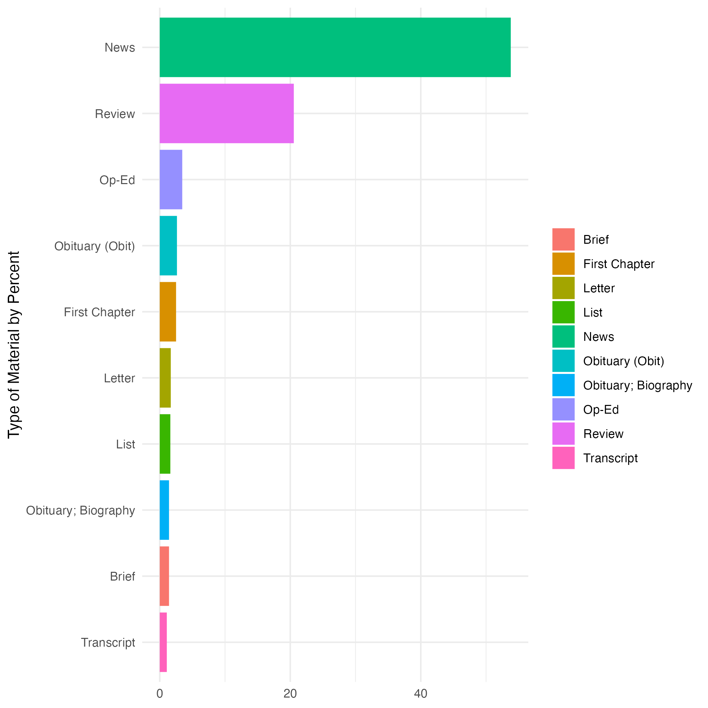
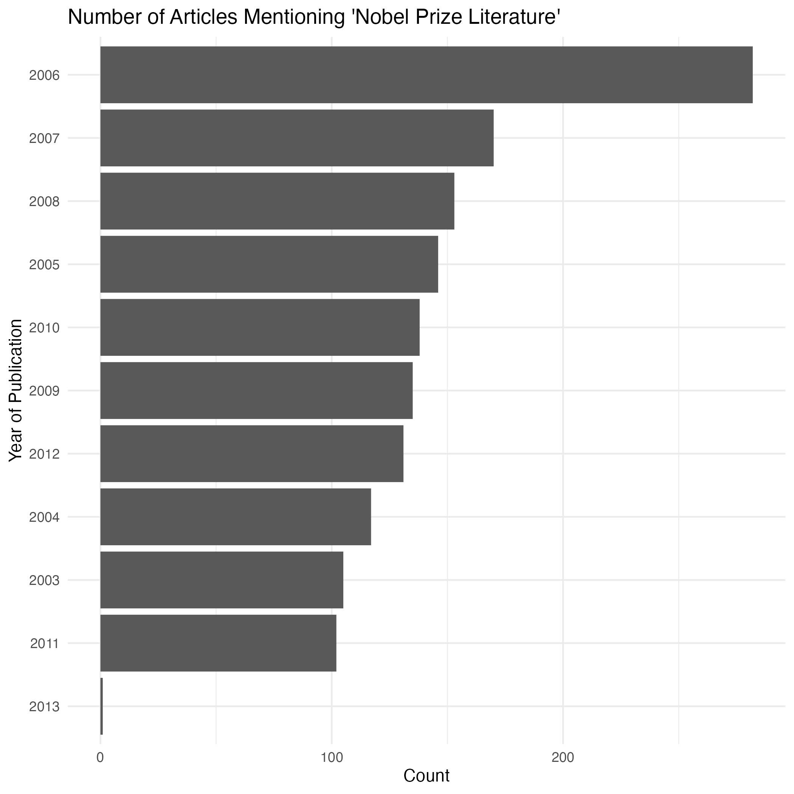

```{r setup, include=FALSE}

if (!(require(httr2))) {
  install.packages("httr2")
}
if (!(require(httpuv))) {
  install.packages("httpuv")
}
if (!(require(ggplot2))) {
  install.packages("ggplot2")
}
if (!(require(jsonlite))) {
  install.packages("jsonlite")
}
if (!(require(dplyr))) {
  install.packages("dplyr")
}
if (!(require(rmarkdown))) {
  install.packages("rmarkdown")
}
if (!(require(knitr))) {
  install.packages("knitr")
}

library(httr2)
library(jsonlite)
library(magrittr)
library(ggplot2)
library(rmarkdown)
library(knitr)

knitr::opts_chunk$set(echo = TRUE)
```

## Introduction

In this introductory workshop, we will access historical and current newspaper data via web APIs using the programming language R. We will use freely available newspaper data from the Library of Congress's Chronicling America website and the New York Times Developer Portal. We will generate dataframes and create some simple data visualizations from downloaded data.

What is the advantage of using an API, as opposed to the regular user interface? The user interface has baked-in limitations that restrict the possible range of queries. One possible justification for using an API is to execute a more complex query. As an example, I can use the state dropdown menu in Chronicling America to return the number of pages of digitized newspapers from New Jersey. But I cannot use that same interface to return the number of times "cats" is mentioned per year. Of course, APIs have limitations too, but generally speaking they support a more granular approach to the data. For quantitative research, web APIs may be used to collect the data corresponding to a query and analyze it in one's programming language of choice.

## Web APIs

An interface is the point at which two different systems meet and communicate. An Application Programming Interface (API) thus represents a way of communicating with a computer application by writing a computer program (a set of machine-readable instructions).

APIs commonly provide an interface either for using functionality or for accessing data. With web services, the interface (the set of "functions" one may call to access the data) takes the form of HTTP requests---a request for data sent following the HyperText Transfer Protocol. This is the same protocol (way of communicating) used by your browser to view a web page. An HTTP request represents a message that your computer sends to a web server (another computer on the internet which "serves," or provides information). That server, upon receiving the request, will determine what data to include in the response it sends back to the requesting computer. With a web browser, the response data takes the form of HTML files that the browser can render as web pages. With data APIs, the response data will be structured data, usually JSON or XML, that may be read and acted upon in a programming language.

In short, collecting data from a web API involves sending an HTTP request to a server for a particular piece of data, and then receiving and parsing the response to that request.

## URIs

The resource you want to access is specified with a Uniform Resource Identifier (URI). A URI is a generalization of a URL (Uniform Resource Locator)---what one commonly thinks of as a web address. URIs behave much like the address on a posted letter sent within a large organization like a university; you indicate the business address as well as the department and the person. You will get a different response (and different data) from Alice in Accounting than from Sally in Sales.

Note that the URI is the identifier (think: variable name) for the resource, while the resource is the actual data value that you want to access.

Like postal addresses, URIs have a specific format used to direct the request to the right resource.

-   *The Base URI*: the domain and part of the path that is included on all resources. It acts as the "root" for any particular resource. For example, Chronicling America has a base URI of `https://www.loc.gov`.
-   *An Endpoint*: a resource on that domain that you wish to access. APIs generally have many endpoints.
-   *Query parameters*: to access only partial sets of data from a resource (e.g., only articles mentioning cats) you also need to include a set of query parameters. These are like extra arguments that are given to the request function. Query parameters are listed after a question mark `?` in the URI, and are formed as key-value pairs.
-   *An API key and/or secret*: many but not all web services require you to register with them in order to send requests. This allows them to limit access to the data, as well as to keep track of who is asking for what data. To facilitate tracking, many services will provide access tokens or API keys.

## Chronicling America

[Chronicling America](https://www.loc.gov/collections/chronicling-america/), a project of the Library of Congress, is a searchable database of U.S. newspapers with descriptive information and select digitized newspaper pages. Rutgers University Libraries contributed to Chronicling America through its participation in the National Digital Newspaper Program (NDNP).[^1]

[^1]: For more information about the Rutgers side of things, visit the [New Jersey Digital Newspaper Project website](https://njdnp.libraries.rutgers.edu/).

Chronicling America provides access to its data in several ways. It is, of course, possible to use the web interface for keyword and metadata searches. Additionally, Chronicling America provides newspaper metadata and data via APIs and bulk downloads.[^2] We will experiment with their API for page-level data in this workshop.

[^2]: Information on the Chronicling America APIs and bulk downloads is available at <https://www.loc.gov/collections/chronicling-america/about-this-collection/technical-information/>.

## African American New Jersey Titles

While it is arguably more efficient to query the website to find out how many pages of newspapers from African American newspapers published in New Jersey are included in Chronicling America, we will answer this question using the API to illustrate how to formulate API queries.

The base URI for LOC APIs is `https://www.loc.gov`.

The endpoint we wish to use is: `/collections/chronicling-america/`.

Some parameters for the pages endpoint are listed here: <https://libraryofcongress.github.io/data-exploration/loc.gov%20JSON%20API/Chronicling_America/README.html#definitions-api-query-paramenters-for-newspapers>. As an example, let's use the `dl=` (display level), `location_state`, `subject_ethnicity`, and `fo` (format) parameters to return the digitized newspaper pages for African American newspapers in New Jersey in the available formats. Load these URLs in a browser window to see what they look like. Note that extra pieces of information are visible with the JSON and YAML responses, like the contributor and the extract timestamp (aka date of last update). *Note*: the JSON and YAML responses additionally want the `start_date` and `end_date` parameters to function as expected. Since this search returns relatively few results (test in the advanced search interface), you can set the date range to be wide. 

-   <https://www.loc.gov/collections/chronicling-america/?searchType=advanced&location_state=new+jersey&subject_ethnicity=african+american> (HTML or default response)
-   <https://www.loc.gov/collections/chronicling-america/?dl=page&location_state=new+jersey&end_date=1928-12-31&searchType=advanced&subject_ethnicity=african+american&start_date=1765-01-01&fo=json> (JSON response)
- <https://www.loc.gov/collections/chronicling-america/?dl=page&location_state=new+jersey&end_date=1928-12-31&searchType=advanced&subject_ethnicity=african+american&start_date=1765-01-01&fo=yaml> (YAML response)

To return to our earlier question, there are 933 results or pages for African American newspaper pages in New Jersey. You can see it in the `facets/filters/count` object.

The Chronicling America API may be used to query newspaper titles, issues, and the page-level OCRed text of digitized newspapers. Bear in mind that the OCR is not error free. We will focus on searching newspaper pages (OCR) in this workshop.

## Constructing a Request

Let's transfer our knowledge about URIs to the API. To do this, let's introduce an additional parameter.

-   `qs`: the search query

```{r cats_request, results='hide'}

# here we use the `request()` function of the httr2 package to construct a request

# create a request
base_url <- "https://www.loc.gov"
endpoint <- "/collections/chronicling-america/"
params <- "?dl=page&end_date=1924-12-31&ops=AND&qs=cat&searchType=advanced&start_date=1924-01-01&fo=json" # search for "cat", return a JSON response
req <- request(paste0(base_url, endpoint, params)) # paste together the URI
req

```


Let's see what the request will send to the server.

```{r dry_run}
req %>% req_dry_run()

```

Let's actually perform the request and fetch a response.

```{r response}

resp <- req %>% req_perform()
resp
```


We can have a look at the headers (or metadata) of the response we retrieved with `resp_headers()` or a specific header with `resp_header()`

```{r headers}

resp %>% resp_headers()
resp %>% resp_header('content-length') # the byte count of the data in the body
```


## Parsing and Transforming the Body of the Response

R is really good at manipulating tables (AKA data frames), less so JSON. Therefore working with a web API often means transforming a JSON response into another format. JSON is a branching structure, and tables are flat, which is to say there's just one level of hierarchy. This is why we will use both the `simplifyVector` argument and the `flatten` function of the `jsonlite` package to transform the response into something R can work with more readily.

Note that while the number of page hits is 50,088, we are only seeing the first 40 results.

```{r cats_df}

# Parse the content and transform into a data frame
cats_json <- fromJSON(resp_body_string(resp), simplifyVector = TRUE)
cats_nested <- cats_json$results
cats_df <- as.data.frame(cats_nested)
cats_df <- flatten(cats_df)

# what are the column names?
names(cats_df)

# have a look at the OCR of the first result
cats_df$word_coordinates_url[1]

# how many page hits? we need to go back to our original JSON response for this value
cats_json$search$hits

```

It is also possible to return to the digitized page by retrieving the `url` value for any given row. Load this URL in your browser window to have a look at the digitized page. Just a reminder that there is value in returning to the context of the newspaper page.

```{r cats_url}

cats_df[1,44] # the url field of the first row (url is stored in column index 44)

```

## Phrase Search

This time, we will use some more functions from the [`httr2` package](https://httr2.r-lib.org/index.html) to construct our request. Note how we are still breaking up the base URI, the endpoint, and the parameters for greater clarity. We will use another parameter, `ops`, to look for a two-word phrase instead of a single word.

A "sanitary train" is terminology specific to World War I. It refers to an ambulance unit that was assigned to support an entire infantry division. We can expect results mainly from the 1917-1918 time frame.

Note that we only get 40 results in our dataframe. But if we examine the `wwi_json$search$hits` value, we see there are many more. We could retrieve these by constructing a for loop and using the `pagination` field to iterate through all the pages of results. Remember there are forty results per page, so we would iterate through `round(1675 / 40)` times.

```{r wwi}

# make request and gather response as JSON
wwi_resp <- request("https://www.loc.gov/collections/chronicling-america/?dl=page&end_date=1918-12-31&ops=PHRASE&qs=sanitary+train&searchType=advanced&start_date=1917-01-01&fo=json") %>% req_perform()

# parse and reformat as data frame
wwi_json <- fromJSON(resp_body_string(wwi_resp), simplifyVector = TRUE)
wwi_nested <- wwi_json$results
wwi_df <- as.data.frame(wwi_nested)
wwi_df <- flatten(wwi_df)

```

Let's take a look at the first response to our query

```{r}

# the description field (indexed as column 9) contains the first several words of the page
wwi_df[1,9]

```
And since the OCR quality makes this article a bit tough to evaluate, let's look at the AKA value (alternative identifier) in column 2. Load it in your browser to take a look. The "Image w/Text" view will allow us to do a ctrl + F to find "sanitary train."

```{r}

wwi_df[1,2]
```

## A for loop to retrieve all search results

In order to go beyond the 40 item response limit of a single API call, we need to implement recursion using the `pagination` values. The following code has been adapted from the [Using Chronicling America to analyze word frequency in newspaper Front Pages](https://libraryofcongress.github.io/data-exploration/loc.gov%20JSON%20API/Chronicling_America/ChronAm_analyzing_word_frequency_newspaper_frontpages.html#using-chronicling-america-to-analyze-word-frequency-in-newspaper-front-pages) IPython notebook.

```{r eval=FALSE}

# Define the search URL
# We will limit ourselves to only front pages by using the `front_pages_only` field
searchURL <- "https://www.loc.gov/collections/chronicling-america/?dl=page&end_date=1918-12-31&front_pages_only=true&ops=PHRASE&qs=sanitary+train&searchType=advanced&start_date=1917-01-01&fo=json"

# Define the function
get_item_ids <- function(url, items = character(), conditional = TRUE, depth = 0, max_depth = 42) {
  if (depth > max_depth) {
    warning("Maximum recursion depth reached. Stopping pagination.")
    return(items)
  }
  # Check that the query URL is not an item or resource link
  exclude <- c("loc.gov/item", "loc.gov/resource")
  if (any(sapply(exclude, grepl, url))) {
    stop("Your URL points directly to an item or resource page. Please use a search URL instead.")
  }

  # Request pages of 100 results at a time
  response <- request(searchURL) %>% req_url_query(fo = "json", c = 100, at = "results,pagination") %>% req_perform()

  # Check that the API request was successful
  if (resp_status(response) == 200) {
    data <- resp_body_json(response)
   
    # Process results
    for (result in data$results) {
      original_format <- result$original_format
      is_collection_or_web <- "collection" %in% original_format || "web page" %in% original_format

      if (!is_collection_or_web && isTRUE(conditional)) {
        item <- result$id
        if (!is.null(item)) {
          if (startsWith(item, "http://www.loc.gov/resource") || startsWith(item, "http://www.loc.gov/item")) {
            items <- c(items, item)
          }
        }
      }
    }

    # Recursively follow pagination
    if (!is.null(data$pagination[["next"]])) {
      next_url <- data$pagination[["next"]]
      items <- get_item_ids(next_url, items, conditional, depth + 1, max_depth)
    }

    return(items)
  } else {
    message("There was a problem. Try running the function again or check your search URL.")
    return(NULL)
  }
}

# Run the query
ids_list <- get_item_ids(searchURL)

# Append '&fo=json' to each item ID
ids_list_json <- sapply(ids_list, function(id) {
  if (!grepl("&fo=json$", id)) {
    paste0(id, "&fo=json")
  } else {
    id
  }
})

# Final list
ids <- ids_list_json

cat("\nSuccess! Your API Search Query found", length(ids), "related newspaper pages. You may proceed.\n")

```
Next, we will want to get some basic metadata associated with the query and store it as a dataframe, and then possibly export it as a CSV file to play around with later. We are implementing the `req_throttle()` function in httr2 to keep within specified rate limits for the API.[^3]

As a fun exercise, try to figure out how you could adapt the code that starts on line 395 to create a bar plot of mentions of "sanitary train" by state using the `df` object.

[^3]: For more on rate limits with the Chronicling America API, see <https://libraryofcongress.github.io/data-exploration/loc.gov%20JSON%20API/Chronicling_America/README.html#rate-limits-and-definitions>.

```{r df, eval=FALSE}
# Create a list to store the item metadata
item_metadata_list <- list()

# Loop through each item URL
for (item_id in ids_list_json) {
  # Build the request with throttling: max 15 requests per 60 seconds
  req <- request(item_id) %>%
    req_throttle(capacity = 15, fill_time_s = 60)

  resp <- req_perform(req)

  # Check for successful response
  if (resp_status(resp) == 200) {
    item_data <- resp_body_json(resp)

    # Skip if 'location_city' is missing
    if (is.null(item_data$item$location_city)) next

    # Extract metadata
    metadata <- list(
      `Newspaper Title` = item_data$item$newspaper_title,
      `Issue Date` = item_data$item$date,
      `Page Number` = item_data$pagination$current,
      `LCCN` = item_data$item$number_lccn,
      `City` = item_data$item$location_city,
      `State` = item_data$item$location_state,
      `Contributor` = item_data$item$contributor_names,
      `Batch` = item_data$item$batch,
      `PDF Link` = item_data$resource$pdf
    )

    item_metadata_list <- append(item_metadata_list, list(metadata))
  }
}

# Convert list of metadata to a data frame
df <- bind_rows(item_metadata_list)

# Reformat date to MM-DD-YYYY
df <- df %>%
  mutate(`Issue Date` = format(lubridate::ymd(`Issue Date`), "%m-%d-%Y"))

cat("\nReady to proceed to the next step!\n")

# flatten lists in order to write to file
# Vector of column names that are lists
list_columns <- c("Newspaper Title", "Page Number", "LCCN", "City", "State", "Contributor", "Batch")

# Flatten each list column by collapsing elements into a comma-separated string
df[list_columns] <- lapply(df[list_columns], function(col) {
  sapply(col, function(x) paste(x, collapse = ", "))
})

# write to file
write.csv(df, "sanitary-train-chronicling-america-search-results.csv", fileEncoding = "UTF-8")

```

## Exercise

Let's get some practice converting a query you perform in the main interface into an API query. Go to <https://www.loc.gov/collections/chronicling-america/> and perform a search using the parameters of your choosing. Note the URL for your search results. How might you alter it to satisfy the httr2 function below?

```{r your_resp, eval=FALSE}

# make request and gather response as JSON
your_resp <- request("https://www.loc.gov/collections/chronicling-america/?[INSERT-YOUR-PARAMS]") %>% 
  req_perform()

# parse and reformat as data frame
json_data <- fromJSON(resp_body_string(your_resp), simplifyVector = TRUE)
nested_data <- json_data$results
df <- as.data.frame(nested_data)
df <- flatten(df)

```

## Some Data Manipulation and Visualization

As a reminder, we've only got the first page of results in the `cats` object. But we can begin to form an idea of which state is the most catified with the following code chunk that makes use of the `dplyr` library for data manipulation. We will add a ggplot2 function call to visualize it as a bar chart.

```{r cats_by_state}

# install.packages("dplyr")
library(dplyr)

# create a derivative dataset called cats_by_state
cats_df[26,21] <- "south carolina" # overwrite previous value of c("georgia", "south carolina") since upon examination this paper was published in SC
cats_df$state <- unlist(cats_df$location_state) # the location_state column is still stored as a list; let's create a new column based upon it with character data

cats_by_state <- cats_df %>% 
  group_by(state) %>% 
  summarize(count = n()) %>% 
  arrange(desc(count))

# let's sort the count values in descending order for our visualization
cats_by_state$state <- factor(cats_by_state$state, levels = cats_by_state$state[order(-cats_by_state$count)])

# visualize as a bar plot
ggplot(cats_by_state, aes(x = state, y = count)) + geom_bar(stat = "identity", fill = "violetred4")

# for help learning dplyr, enter help(package = "dplyr") in the console

```

## NYT APIs: Preliminaries

Unlike Chronicling America, the New York Times APIs do require user credentials.

Go to <https://developer.nytimes.com/signup>. Click Create account and follow the prompts to register. Notice that the New York Times offers several APIs, including Article Search, Archive, Books, Comments, Movie Reviews, Top Stories, and more.

Once logged in, create an app for your research by clicking on your user name in the upper right and selecting Apps > + NEW APP. In your app, be sure to enable the Article Search API. You may elect to enable others in the same app.

Next, copy your API Key and paste it below where indicated. The API Key is personal to you and should be closely guarded. A good way to start is to store it as an environment variable. Alternatively, you can save your key to file locally and access it via the `load()` function.

```{r key, eval=FALSE}

## set your NYT as system variables to access during our session
## replace the stuff in quotes with your personal key

Sys.setenv(nyt_apikey="YOUR_NYT_API_KEY_HERE")

## alternatively, you can save your key to file and access it when needed with the `load()` function

nyt_apikey <- "YOUR_NYT_API_KEY_HERE"
save(nyt_apikey, file = "nytimes_apikey")
```

## NYT Article Search API

The New York Times APIs are well documented. Googling will yield lots of tutorials and documentation.

To experiment with queries before running them in R, I recommend using the "Try this API" feature of the Developers' website. Under APIs, go to Article Search. Press "Authorize" (upper right) to authenticate your connection to the API. In the left panel, click `/articlesearch.json` under PATHS to launch the "Try this API" feature. And now let's test some queries.


As a first example, let's keep it simple. Set the `q` value to 'armistice' (it is not case sensitive) and press "EXECUTE." The response is in JSON. Note how many hits you get (look at the bottom of the response) and observe the different document types you retrieve.

Now, let's try using some of the filter query parameters. Leave the `q` value set to 'armistice' and this time set `fq` (filter query) to 'article'. Press "EXECUTE". You should go down from 10,000 hits to 2,054 hits.

## NYT Article Search API: First Request

Let's start with the q parameter, which searches the body, headline, and byline for relevant results. Note that we are still breaking down the URI as before, into base URI, endpoint, and parameters. This time we need to pass our API key into the URI as well. 

```{r nobel}

# read your NYT api key back into memory, if needed
load("nytimes_apikey")

nobel <- request("https://api.nytimes.com/svc/search/v2") %>% 
  req_url_path_append("/articlesearch.json") %>% 
  req_url_query(`api-key` = nyt_apikey, 
                q = "Nobel prize literature") %>%
  req_perform()

nobel
```
Like most web APIs, this one returns a JSON response.

```{r str, results='hide'}

# the str() function in R displays the internal structure of an R object; it allows you to see all the nested structures and data types of the JSON response
nobel %>% resp_body_json() %>% str()
```

As usual, we are going to convert JSON into a dataframe to make it more manageable in R. First, we convert the response to text (string), then we parse and flatten it. 

```{r nobel_flat}

nobel <- nobel %>% resp_body_string()

nobel_flat <- fromJSON(nobel, flatten = TRUE) %>% data.frame()

```

## NYT Article Search API: For Loop and Rate Limits

As before with the Chronicling America API, we're dealing with the first page of results. Only 10 in this case. This time we will build a for loop to retrieve more.

It's rather easy to hit rate limits with the New York Times APIs. Rate limits are imposed to prevent you from making too many server requests and possibly overwhelming their servers. The NYT [FAQs](https://developer.nytimes.com/faq#a11) indicate that you should insert 12 seconds in between calls and make no more than 5 requests per minute. There are various ways of handling this, including the `req_throttle()` argument of httr2. We will use `Sys.sleep()` to introduce a generous 15 second pause in between requests.

*Nota bene*: this code chunk will take approx. 30 minutes to run. If you don't want to wait that long, the easiest way to tweak it is to shorten the date window. 

```{r nobel_articles, eval=FALSE}

# read your NYT api key back into memory, if needed
load("nytimes_apikey")

# Parameters
term <- "nobel+prize+literature" # Need to use + to string together separate words
begin_date <- "20030101" # Let's look at 10 years of matches
end_date <- "20130101"

baseurl <- paste0("http://api.nytimes.com/svc/search/v2/articlesearch.json?q=",term,
                  "&begin_date=",begin_date,"&end_date=",end_date,
                  "&facet_filter=true&api-key=",nyt_apikey, sep="")

# create request
initialQuery <- fromJSON(baseurl) 

# determine how many pages of results to go through (93)
maxPages <- round((initialQuery$response$meta$hits[1] / 10)-1)

# initialize object to store page results
nobel_pages <- vector("list",length=maxPages)

# loop through pages
for(i in 0:maxPages){
  nytSearch <- fromJSON(paste0(baseurl, "&page=", i), flatten = TRUE) %>% data.frame() 
  nobel_pages[[i+1]] <- nytSearch 
  Sys.sleep(15) # wait 15 seconds between calls
}

# paste together page objects into a new dataframe
nobel_articles <- rbind_pages(nobel_pages)

nobel_articles[1:10,20] # looking at headline for the first 10 rows

```

## NYT Article Search API: Visualizations

Coverage by section.

```{r p1, eval=FALSE}

# Visualize coverage by section
p1 <- nobel_articles %>% 
  group_by(response.docs.type_of_material) %>%
  summarize(count=n()) %>%
  mutate(percent = (count / sum(count))*100) %>% 
  arrange(desc(percent)) %>% 
  filter(!is.na(response.docs.type_of_material)) %>% 
  top_n(10, percent) %>% 
  ggplot(aes(x=reorder(response.docs.type_of_material, percent), y=percent, fill = response.docs.type_of_material)) +
  geom_bar(stat = "identity") + 
  labs(x = "Type of Material by Percent", y = NULL) +
  guides(fill=guide_legend(title=NULL)) +
  theme_minimal() +
  coord_flip()

p1
```


Years with the most coverage.

```{r p2, eval=FALSE}

p2 <- nobel_articles %>%
  mutate(pubDay = gsub("T.*","",response.docs.pub_date),
         pubYear = lubridate::year(pubDay)) %>%
  group_by(pubYear) %>% 
  summarise(count=n()) %>% 
  ggplot(aes(x=reorder(pubYear, count), y=count)) +
  geom_bar(stat="identity") + 
  labs(x = "Year of Publication", y = "Count", title = "Number of Articles Mentioning 'Nobel Prize Literature'") + 
  theme_minimal() +
  coord_flip() 

p2

```


So, what went on in 2006? There are several factors, but two obvious contributors were the revelation of Gûnther Grass's controversial past as well Turkish writer Orhan Pamuk's award that year, which came as something of a surprise.

```{r detail, eval=FALSE}

# reformat the pub_date as a date object in R, then pass a filter for 2006
nobel_articles %>% 
  mutate(pub_date = lubridate::ymd_hms(response.docs.pub_date, tz="UTC")) %>%
  filter(pub_date > "2005-12-31 00:00:00" &
         pub_date < "2007-01-01 00:00:00") %>%
  select(response.docs.headline.main, response.docs.word_count) %>% #select headline and word count
  arrange(desc(response.docs.word_count)) %>% # descending sort by word count
  View() # open table view

```


## Exercise: NYT Article Search API

Develop your own query for Article Search. Use Boehmer's slides, which are excellent, as a reminder of the possibilities and syntax: <http://jamesboehmer.github.io/nytd2013/#/6>.

```{r your_nyt, eval=FALSE}

# read your NYT api key back into memory, if needed
# load("nytimes_apikey")

your_nyt <- request("https://api.nytimes.com/svc/search/v2") %>% 
  req_url_path_append("/articlesearch.json") %>% 
  req_url_query(`api-key` = nyt_apikey, 
                q = "YOUR KEYWORDS") %>%
  req_perform()

your_nyt <- your_nyt %>% resp_body_string()

your_nyt_flat <- fromJSON(your_nyt, flatten = TRUE) %>% data.frame()
```


## Sources

Boehmer, James. "The New York Times Article Search API." 2013. <http://jamesboehmer.github.io/nytd2013/>.

Evans, Daniel. “Chronicling America’s Newspaper Biographies as Data.” The National Endowment for the Humanities (blog), February 16, 2023. <https://www.neh.gov/blog/chronicling-americas-newspaper-biographies-data>.

Fitzgerald, Jonathan D. "Working with The New York Times API in R." 2018. <https://www.storybench.org/working-with-the-new-york-times-api-in-r/>.

Freeman, Michael, and Joel Ross. "Accessing Web APIs." In *Technical Foundations of Informatics*. Seattle, WA: UW Information School, 2019. <https://info201.github.io/>.

LC Labs. "Library of Congress Data Exploration." Last updated May 17, 2023. <https://github.com/LibraryOfCongress/data-exploration>

## Projects that Use Newspaper Data

Interested in exploring projects in the humanities that use newspaper data? You might be interested in the winners of the [Chronicling America Data Challenge](https://www.neh.gov/news/press-release/2016-07-25). I'd also recommend searching [_Reviews in Digital Humanities_](https://reviewsindh.pubpub.org/) for any mention of "newspaper."

Lastly, Martin Saveedra (thanks, Martin!) tipped me off to the work of Melissa Dell on the Chronicling America data that improves OCR and detects content areas. I haven't dipped into it yet, but I thought I'd pass along the information. "American Stories": <https://dell-research-harvard.github.io/resources/americanstories>.